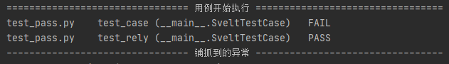
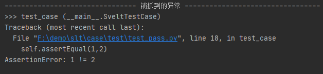
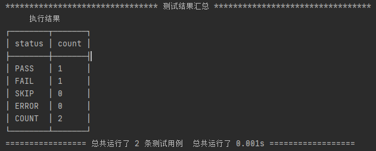
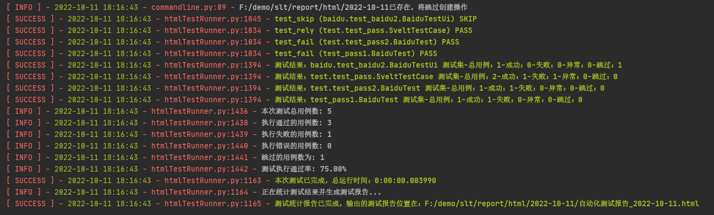

## 测试固件

::: info 测试固件

sveltest 测试固件完全与unittest一样，因为sveltest.TestCase继承的就是unittest.TestCase

:::

sveltest 提供四个固件方法：setUp()、tearDown()、setUpClass()、tearDownClass()

### 方法说明

| 方法               | 说明                                                         |
| ------------------ | ------------------------------------------------------------ |
| setUp(self)        | 在每个测试用例方法执行前执行该方法，常用与测试前的准备工作   |
| tearDown(self)     | 在每个测试用例方法执行后执行该方法，常用与测试后的环境清理工作 |
| setUpClass(cls)    | 在每个测试用例类执行前执行该方法，常用与测试前的准备工作     |
| tearDownClass(cls) | 在每个测试用例类执行后执行该方法，常用与测试后的环境清理工作 |


```python
@classmethod
def setUpClass(cls):
	
@classmethod
def tearDownClass(cls):
	
def tearDown(self):

def setUp(self):
 
```


## 断言

> 使用python中的断言来自动检测python程序中的错误，让程序更加可靠且更易于调试
>
> 从根本上来说，python中的断言语句是一种调试工具，用来测试某个断言条件，如果断言条件为True，则程序将继续正常执行；但如果断言条件为假False，则会引发AssertionError异常并显示相关的错误消息。
>
> 执行[自动化测试](https://so.csdn.net/so/search?q=自动化测试&spm=1001.2101.3001.7020)中最重要的就是判断用例是否执行通过。


### 断言过程

⑴如果断言成功，则无影响，代码继续执行，标识该[测试用例](https://so.csdn.net/so/search?q=测试用例&spm=1001.2101.3001.7020)为成功状态

⑵如果断言失败，则抛出一个AssertionError，并标识该测试用例为失败状态

⑶如果用例执行过程中发生异常，则当做错误来处理


### 基本的断言方法

::: tip 说明

sveltest继承的是unittest，unittest包含的所有断言方法均可在sveltest使用，后续sveltest也会新增自己的断言方法

 :::


| 断言方法                                       | 断言描述                                           | 备注                    |
| ---------------------------------------------- | -------------------------------------------------- | ----------------------- |
| assertEqual(arg1, arg2, msg=None)              | 验证arg1=arg2，不等则fail                          | arg1 = arg2             |
| assertNotEqual(arg1, arg2, msg=None)           | 验证arg1 != arg2, 相等则fail                       | arg1 != arg2            |
| assertTrue(expr, msg=None)                     | 验证expr是true，如果为false，则fail                | bool(expr) IS true      |
| assertFalse(expr,msg=None)                     | 验证expr是false，如果为true，则fail                | bool(expr) IS false     |
| assertIs(arg1, arg2, msg=None)                 | 验证arg1、arg2是同一个对象，不是则fail             | arg1 is arg2            |
| assertIsNot(arg1, arg2, msg=None)              | 验证arg1、arg2不是同一个对象，是则fail             | arg1 not is arg2        |
| assertIsNone(expr, msg=None)                   | 验证expr是None，不是则fail                         | expr is one             |
| assertIsNotNone(expr, msg=None)                | 验证expr不是None，是则fail                         | expr not is one         |
| assertIn(arg1, arg2, msg=None)                 | 验证arg1是arg2的子串，不是则fail                   | arg1 in arg2            |
| assertNotIn(arg1, arg2, msg=None)              | 验证arg1不是arg2的子串，是则fail                   | arg1 not in arg2        |
| assertIsInstance(obj, cls, msg=None）          | 验证obj是cls的实例，不是则fail                     | IsInstance(obj,cls)     |
| assertNotIsInstance(obj, cls, msg=None)        | 验证obj不是cls的实例，是则fail                     | not IsInstance(obj,cls) |
| assertGreater (first, second, msg = None)      | 验证first > second，否则fail                       |                         |
| assertGreaterEqual (first, second, msg = None) | 验证first ≥ second，否则fail                       |                         |
| assertLess (first, second, msg = None)         | 验证first < second，否则fail                       |                         |
| assertLessEqual (first, second, msg = None)    | 验证first ≤ second，否则fail                       |                         |
| assertRegexpMatches (text, regexp, msg = None) | 验证正则表达式regexp搜索==匹配 ==的文本text regexp | 通常使用re.search()     |


## main方法

> main函数为sveltest中测试执行的主程序入口，提供丰富的功能来满足我们测试工作。


```python
def __init__(
    self, run_case_path:Optional[Any]="__main__",
    debug:Optional[bool]=True,
    verbosity:Optional[int]=1, failfast:Optional[Union[str,bool,int]]=None,
    title:Optional[str]="sveltest Test Report", tester:Optional[str]="Anonymous",
    description:Optional[str]="Test case execution",
    save_last_try:Optional[bool]=False,
    thread_count:int = 0
):
```


### 参数说明

**run_case_path**：测试用例执行路径

[**debug**]()：选择本次运行测试的DEBUG模式，默认为True

**verbosity**：测试运行时的日志输出等级

**failfast**：指定的失败测试用例

**title**：测试报告标题

**description**：测试用例报告的详细描述信息

**save_last_try**：测试异常后是否截图

**thread_count**：多线程执行用例


## 完善的测试调试结果

> sveltest 对内置的执行器进行了处理美化了本地调试时执行测试用例输出的测试结果方便我们对测试开发中异常的定位及解决问题的效率大大提升。


### DEBUG模式下的日志结果

DEBUG模式下,默认的verbosity是为1，总共等级为1,2

```python
if __name__ == '__main__':
    main(debug=True,verbosity=1)
```


```

================================ 用例开始执行 =================================
test_case (__main__.SveltTestCase)   F
test_rely (__main__.SveltTestCase)   OK
-------------------------------- 铺抓到的异常 ---------------------------------
>>> test_case (__main__.SveltTestCase)
Traceback (most recent call last):
  File "F:\demo\slt\case\test\test_pass.py", line 18, in test_case
    self.assertEqual(1,2)
AssertionError: 1 != 2

******************************** 测试结果汇总 *********************************
     执行结果     
┌────────┬───────┐
│ status │ count │
├────────┼───────┤
│ PASS   │ 1     │
│ FAIL   │ 1     │
│ SKIP   │ 0     │
│ ERROR  │ 0     │
│ COUNT  │ 2     │
└────────┴───────┘
================= 总共运行了 2 条测试用例  总共运行了 0.001s ==================
```


verbosity为2

```python
if __name__ == '__main__':
    main(debug=True,verbosity=2)
```

```
================================ 用例开始执行 =================================
test_pass.py    test_case (__main__.SveltTestCase)   FAIL
test_pass.py    test_rely (__main__.SveltTestCase)   PASS
-------------------------------- 铺抓到的异常 ---------------------------------
>>> test_case (__main__.SveltTestCase)
Traceback (most recent call last):
  File "F:\demo\slt\case\test\test_pass.py", line 18, in test_case
    self.assertEqual(1,2)
AssertionError: 1 != 2

******************************** 测试结果汇总 *********************************
     执行结果     
┌────────┬───────┐
│ status │ count │
├────────┼───────┤
│ PASS   │ 1     │
│ FAIL   │ 1     │
│ SKIP   │ 0     │
│ ERROR  │ 0     │
│ COUNT  │ 2     │
└────────┴───────┘
================= 总共运行了 2 条测试用例  总共运行了 0.001s ==================
```


### 用例信息描述

在输出的测试结果中该区域用于列出当前模块执行的所有测试用例，根据不同的verbosity显示的详细程度不一样




### 异常铺抓

在测试用例执行时出现异常，断言失败等都会将异常信息进行铺抓




### 测试结果汇总

记录的是本次测试执行的测试用例状态情况，按照不同状态进行分别统计：

- [x] PASS(通过的用例)
- [x] FAIL(断言失败的用例/未通过测试的用例)
- [x] SKIP(跳过执行的用例)
- [x] ERROR(出现异常的用例)





### 非DEBUG模式下

::: danger 警告

如果你想在单一测试脚本下使用非DEBUG,那么你可能什么也做不了。因为非DEBUG模式只能是在[工程入口文件执行]()

 ::: 

因为main对不同的DEBUG模式采用不用的测试执行器具体原理可[点击查看]()

```python
Traceback (most recent call last):
  File "F:\demo\slt\case\test\test_pass.py", line 34, in <module>
    main(debug=False,verbosity=3)
  File "D:\python39\lib\site-packages\sveltest\runner.py", line 437, in __init__
    raise Exception("请在使用manage.py文件进行非DEBUG模式执行测试")
Exception: 请在使用manage.py文件进行非DEBUG模式执行测试
```


manage 下执行

```python
"""用于管理任务的框架命令行实用程序。"""

import os
import sys


BASE_DIR = os.path.dirname(__file__)
sys.path.append(BASE_DIR)
os.environ.setdefault('SVELTEST_TEST_SETTINGS_MODULE','slt.settings')

import sveltest
sveltest.main(debug=False)
```




## 多线程支持

> 对于用例少的测试项目来说，多线程可不必关注它。如果用例一旦过多那么执行的效率及时间也就更高，因此我们需要有多线程来支持我们快速的完成测试用例的执行。
>
> sveltest将引入了多线程来帮助我们更快的执行用例，降低时间成本。


::: details 多线程具体细节

sveltest 多线程是通过[线程池]()来实现的Python 内置的 `ThreadPoolExecutor`就能实现多线程：

- [x] ThreadPoolExecutor构造实例时，输入max_workers参数，设定线程池中最多可同时运行的线程数。
- [x] 使用submit函数将需要执行的任务(函数名和参数)提交到线程池中，然后返回任务的句柄。
- [x] submit不是堵塞的，而是立即返回。

 ```python
 with ThreadPoolExecutor(max_works=16) as executor:
     futures = {executor.submit(func, arg):arg for arg in args}
     for future in as_completed(futures):
         future.result()
 ```

 :::

要想在sveltest使用多线程执行测试用例也非常简单，你只需要在`main()`方法中出入`thread_count`参数即可

::: danger 注意

由于`ThreadPoolExecutor`内置默认thread_count为4，因此在**sveltest**如果你不传入任何值则不会通过线程池来执行测试用例

 :::

```python
if __name__ == '__main__':
    main(debug=True,thread_count=2)
```


## 用例依赖

> 可以在需要执行用例时依赖于其它用例，则可以考虑引入用例依赖


### @rely

用于装饰一个需要依赖其它用例的用例方法上

```python
def rely(case_name:str=None)
```


### 参数说明：

**case_name**：为依赖的用例名称(测试用例方法名称)


依赖用例执行正常

```python

from sveltest import TestCase, rely
from sveltest import main

class SveltTestCase(TestCase):

    def test_case(self):
        """第一测试用例demo"""
        self.assertEqual(1,1)

    @rely('test_case')
    def test_rely(self):
        """第一测试用例demo"""
        self.assertEqual(1,1)


if __name__ == '__main__':
    main(debug=True,thread_count=1)
```


运行结果：

```
================================ 用例开始执行 =================================
test_case (__main__.SveltTestCase)   PASS
test_rely (__main__.SveltTestCase)   PASS
******************************** 测试结果汇总 *********************************
     执行结果     
┌────────┬───────┐
│ status │ count │
├────────┼───────┤
│ PASS   │ 2     │
│ FAIL   │ 0     │
│ SKIP   │ 0     │
│ ERROR  │ 0     │
│ COUNT  │ 2     │
└────────┴───────┘
================= 总共运行了 2 条测试用例  总共运行了 0.001s ==================
```


依赖用例执行失败

```

================================ 用例开始执行 =================================
test_case (__main__.SveltTestCase)   FAIL
test_rely (__main__.SveltTestCase)    test_case 
该用例所关联的用例执行失败或已被跳过执行   SKIP
-------------------------------- 铺抓到的异常 ---------------------------------
>>> test_case (__main__.SveltTestCase)
Traceback (most recent call last):
  File "F:\demo\slt\case\test\test_pass.py", line 18, in test_case
    self.assertEqual(1,2)
AssertionError: 1 != 2

******************************** 测试结果汇总 *********************************
     执行结果     
┌────────┬───────┐
│ status │ count │
├────────┼───────┤
│ PASS   │ 0     │
│ FAIL   │ 1     │
│ SKIP   │ 1     │
│ ERROR  │ 0     │
│ COUNT  │ 2     │
└────────┴───────┘
================= 总共运行了 2 条测试用例  总共运行了 0.002s ==================
```


## 跳过测试

> 在某些场景下一些用例我们不想让它们执行，但又需要它们的存在因此我们可以使用跳过用例来满足


::: tip 提示

sveltest 用例跳过与unittest一样也是使用装饰器来装饰一个不想执行的用例

 :::

```python

def skip(reason):
    """
    Unconditionally skip a test.
    """

def skipIf(condition, reason):
    """
    Skip a test if the condition is true.
    """

def skipUnless(condition, reason):
    """
    Skip a test unless the condition is true.
    """

def expectedFailure(test_item):
    test_item.__unittest_expecting_failure__ = True
    return test_item
```


### 方法说明

**skip(reason)**：无条件的跳过执行

**skipIf(condition, reason)**：表达式成立则会跳过用例执行

**skipUnless(condition, reason)**：表达式不成立则会跳过用例执行

**expectedFailure(test_item)**：如果test失败了，这个test不计入失败的case数目


### 参数说明

**reason**：说明

**condition**：表达式


使用跳过测试用例装饰成功后则会在测试报告中记录状态为 SKIP