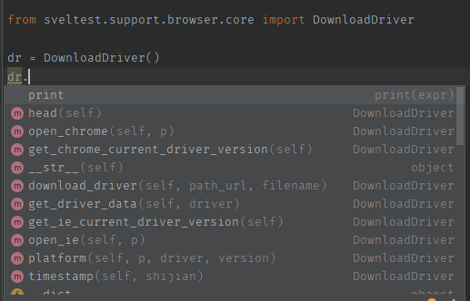
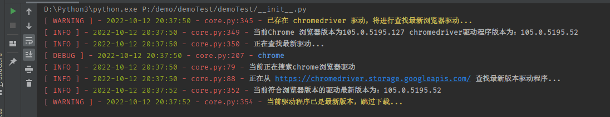
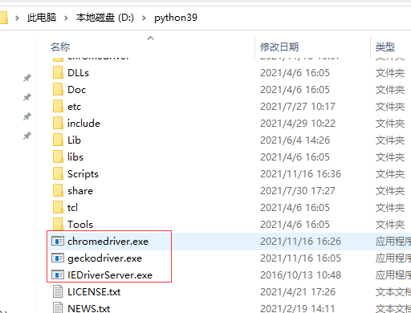

## 自动化下载浏览器驱动

`sveltest`为了考虑到在我们测试的时候经常会有浏览器自动升级更新、这是时候有时会导致浏览器版本于驱动器版本不一致导致经常抛出异常然而需要自己去动手下载对应版本的驱动、为了解决这个问题，sveltest自带了自动下载最新浏览器驱动方法，下面我们体验一下：


### 支持的驱动

| 浏览器驱动 | 支持的平台                 | 驱动名称 |
| ---------- | -------------------------- | -------- |
| chrome     | linux、window(win32,win64) | chrome   |
| ie         | linux、window(win32,win64) | ie       |

目前仅支持以上二种驱动下载方式、后续将陆续集成剩下的全部驱动。


### 下载驱动

进行导入 DownloadDriver 类进行下载对应驱动,下面我们可以看到部分提供出来的API。




open_chrome方法用于下载chrome浏览器驱动，传递一个平台架构参数即可下载chrome浏览器,默认为win32。

```
from sveltest.support.browser.core import DownloadDriver

dr = DownloadDriver()
dr.open_chrome()
```


第一个参数指定需要下载的驱动、需要是字符串类型、输入上方支持的驱动的驱动名称即可下载对应驱动

```python
from sweet.lib.drivermirrors.chrome import DownloadDriver

driver = DownloadDriver("chrome")

driver.update_download(type="win32")
```




这里需要注意、下载的驱动会自动的下载到你的电脑D盘下的driver目录下



是已压缩文件进行保存的、然后它又会自动的给你解压到Python安装目录下的根目录下


## 命令行工具进行下载

后续提供下载

