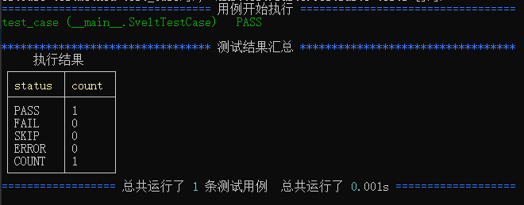

sveltest 测试执行有以下几种方法：

::: danger 建议

sveltest 强烈建议使用命令行执行

 :::

- [x] [单用例文件执行](./test_run#当前文件执行)
- [x] [工程入口文件执行](./test_run#工程入口文件执行)


## 当前文件执行

### pycharm

如果pycharm执行当前用例文件那么需要进行[配置]()相关执行环境来运行sveltest编写的测试用例；


### 命令行执行

```
python test_svelt.py
```




## 工程入口文件执行

::: tip 入口文件

sveltest 可以使用CLI工具来构建自动化测试项目，因此创建的自动化测试工程后会有一个主执行文件`manage.py`,即在项目的根目录下

 :::

```python
"""用于管理任务的框架命令行实用程序。"""


import os
import sys


BASE_DIR = os.path.dirname(__file__)
sys.path.append(BASE_DIR)
os.environ.setdefault('SVELTEST_TEST_SETTINGS_MODULE','slt.settings')

import sveltest
sveltest.main(debug=False)
```

该文件使用的也是main这个主程序方法，使用的默认模式为非DEBUG,该模式适合用于生产环境,具体定义如下：

- [DEBUG模式](#)：定义为在开发自动化测试时的本地调试环境(这里我们定义为开发环境)
- [非DEBUG模式](#)：定义为自动化测试项目部署到了测试执行机器上(这里我们定义为生产环境)
