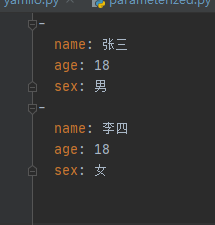
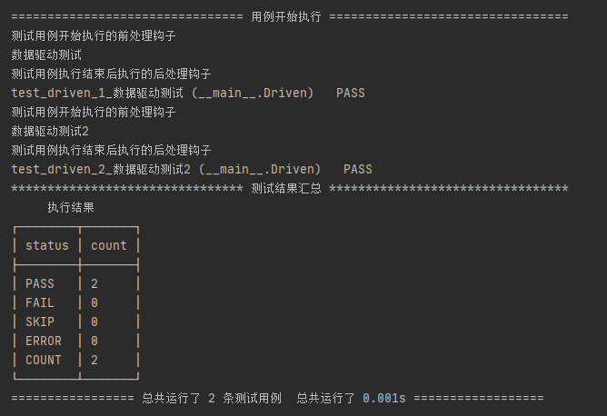

parameterized 是 sveltest 中实现参数化一个组件，可以传入多组参数，自动生成多个用例、采用数据驱动对不同测试数据相同脚本进行自动生成多个测试用例。

提供较为强大的数据驱动功能：MySQL,Redis，多种文件参数化等。


简单实例：

```python
from sveltest import TestCase
from sveltest  import main
from sveltest  import parameterized,char


@parameterized()
class BaiduTestUi(TestCase):

    def setUp(self):
        print("数据驱动测试")

    @char("数据驱动","测试工程师")
    def test_data(self,a):
        print(a)


    def tearDown(self):
        pass


if __name__ == '__main__':
    main()
```

执行后的结果

```python
================================ 用例开始执行 =================================
数据驱动测试
数据驱动
test_data_1 (__main__.BaiduTestUi)   PASS
数据驱动测试
测试工程师
test_data_2 (__main__.BaiduTestUi)   PASS
******************************** 测试结果汇总 *********************************
     执行结果     
┌────────┬───────┐
│ status │ count │
├────────┼───────┤
│ PASS   │ 2     │
│ FAIL   │ 0     │
│ SKIP   │ 0     │
│ ERROR  │ 0     │
│ COUNT  │ 2     │
└────────┴───────┘
================= 总共运行了 2 条测试用例  总共运行了 0.001s ==================
```

看以上案例可以很明显的发现、有点像ddt，没错其实sveltest中的parameterized  模块就是在ddt集基础上进行改造、内部核心代码已被80%重构并且扩展了很多实用的功能及方法、下面我们一起来体验！！！


## 以字符串类型进行参数化

char() 装饰器就给我们提供了字符串类型数据、只能传递字符串类型否则会抛出异常

```python
@parameterized()
class BaiduTestUi(TestCase):

    def setUp(self):
        print("数据驱动测试")

    @char("数据驱动","测试工程师")
    # 每个字符串都将包装成一个测试用例、并且可以将每个字符串内容传递给测试用例
    # 提供测试数据支持
    def test_data(self,a):
        print(a)


    def tearDown(self):
        pass


if __name__ == '__main__':
    main()
```

### 非字符串类型数据

```python
@parameterized()
class BaiduTestUi(TestCase):

    def setUp(self):
        print("数据驱动测试")

    @char(["数据驱动","测试工程师"])
    # 如果你传递列表或不是字符串类型的任何数据类型都会抛出异常
    def test_data(self,a):
        print(a)


    def tearDown(self):
        pass


if __name__ == '__main__':
    main()
```


## 元组或列表进行数据驱动

如果想要使用列表或者元组作为数据进行驱动测试、那么你应该使用`@extends(data)`

```python
from sveltest import parameterized,extends


@parameterized()
class BaiduTestUi(TestCase):

    def setUp(self):
        print("数据驱动测试")

    @extends(["数据驱动","测试工程师"])
    # 支持元组与列表
    # 如果不为元组或列表将抛出异常
    def test_data(self,a,b):
        print(a,b)


    def tearDown(self):
        pass


if __name__ == '__main__':
    main()
```

这里我们需要主要的是一个一维数组仅为一条测试用例提供服务、也就是说你的一维列表或者元组有多少个元素、那么这些元素将全部通过参数的方式提供给你的测试用例,如果你想一条用例支持多个参数就可以使用该装饰器进行驱动了。


### 实现多用例多参数

```python
@parameterized()
class BaiduTestUi(TestCase):

    def setUp(self):
        print("数据驱动测试")

    @extends(["数据驱动测试","测试工程师"],["数据驱动测试2","测试工程师"])
    # 支持元组与列表
    # 如果不为元组或列表将抛出异常
    def test_data(self,a,b):
        print(a,b)


    def tearDown(self):
        pass
```

结果

```python
================================ 用例开始执行 =================================
数据驱动测试
数据驱动测试 测试工程师
test_data_1_数据驱动测试 (__main__.BaiduTestUi)   PASS
数据驱动测试
数据驱动测试2 测试工程师
test_data_2_数据驱动测试2 (__main__.BaiduTestUi)   PASS
******************************** 测试结果汇总 *********************************
     执行结果     
┌────────┬───────┐
│ status │ count │
├────────┼───────┤
│ PASS   │ 2     │
│ FAIL   │ 0     │
│ SKIP   │ 0     │
│ ERROR  │ 0     │
│ COUNT  │ 2     │
└────────┴───────┘
================= 总共运行了 2 条测试用例  总共运行了 0.001s ==================
```

使用上面方法进行多用例多数据进行测试、这里注意使用`@extends(data)`进行驱动测试、会将索引为0的元素用例作为测试用例名称、并且在使用html格式的测试报告中也会显示该名称。


## 使用字典进行测试

使用字典类型进行测试就需要使用 `serialization()`装饰器与其上面的装饰器一样仅支持字典类型数据、否则会抛出异常。


简单示例：

```python
from sveltest import parameterized,serialization

from sveltest import TestCase
@parameterized()
class BaiduTestUi(TestCase):

    def setUp(self):
        print("数据驱动测试")

    @serialization({"name":"数据驱动测试","obj":"测试工程师"})
    # 仅支持dict
    # 如果不为dict将抛出异常
    def test_data(self,name,obj):
        print(name,obj)


    def tearDown(self):
        pass


if __name__ == '__main__':
    main()
```

使用@serialization() 装饰器一定要主要变量名不能随便定义了、需要根据你的字段key作为参数名来获取，如果你的数据中带有 key 为title那么将会已title作为你的测试用例名称。

```python
@parameterized()
class BaiduTestUi(TestCase):

    def setUp(self):
        print("数据驱动测试")

    @serialization({"title":"测试001","name":"数据驱动测试","obj":"测试工程师"},{"title":"测试002","name":"数据驱动测试","obj":"测试工程师"})
    # 仅支持dict
    # 如果不为dict将抛出异常
    def test_data(self,title,name,obj):
        print(name,obj)


    def tearDown(self):
        pass


if __name__ == '__main__':
    main()
```

具体结果

```python
================================ 用例开始执行 =================================
数据驱动测试
数据驱动测试 测试工程师
test_data_测试001 (__main__.BaiduTestUi)   PASS
数据驱动测试
数据驱动测试 测试工程师
test_data_测试002 (__main__.BaiduTestUi)   PASS
******************************** 测试结果汇总 *********************************
     执行结果     
┌────────┬───────┐
│ status │ count │
├────────┼───────┤
│ PASS   │ 2     │
│ FAIL   │ 0     │
│ SKIP   │ 0     │
│ ERROR  │ 0     │
│ COUNT  │ 2     │
└────────┴───────┘
================= 总共运行了 2 条测试用例  总共运行了 0.001s ==================
```


## 文件数据参数化


### json 文件

```python
from sveltest import TestView,main,parameterized,FileData


@parameterized()
class TestDemoTo1(TestView):
    """简单的测试demo"""

    def setUp(self):
        pass

    def tearDown(self):
        pass

    @FileData.json(file=r"F:\result_001.json",)
    def test_case_demo(self,label,text,time):
        print(label,text,time)


if __name__ == '__main__':
    main(verbosity=1)
```


結果

```python
================================ 用例开始执行 =================================
5.png ['也许是由于对天蝎远况的同情。'] 12
test_case_demo_1 (__main__.TestDemoTo1)   PASS
4.png ['也许是天蝎神秘的行躁,'] 11
test_case_demo_2 (__main__.TestDemoTo1)   PASS
7.png ['曾经相信爱情是日生情的篮羯开始相信'] 19
test_case_demo_3 (__main__.TestDemoTo1)   PASS
2.png ['一百以观实自居的魔羯竟然与天蝎发生了网志。'] 17
test_case_demo_4 (__main__.TestDemoTo1)   PASS
******************************** 测试结果汇总 *********************************
     执行结果     
┌────────┬───────┐
│ status │ count │
├────────┼───────┤
│ PASS   │ 4     │
│ FAIL   │ 0     │
│ SKIP   │ 0     │
│ ERROR  │ 0     │
│ COUNT  │ 4     │
└────────┴───────┘
================= 总共运行了 4 条测试用例  总共运行了 0.001s ==================
```

### yaml文件



```python
-
  name: 张三
  age: 18
  sex: 男
-
  name: 李四
  age: 18
  sex: 女
```

代码示例：

```python
from sveltest import TestView, main, parameterized, FileData

@parameterized()
class TestDemoTo1(TestView):
    """简单的测试demo"""

    def setUp(self):
        pass

    def tearDown(self):
        pass

    @FileData.yaml(file="test.yaml")
    def test_case_demo(self, sex, name, age):
        print(sex, name, age)


if __name__ == '__main__':
    main(verbosity=1)
```

结果

```python
================================ 用例开始执行 =================================
男 张三 18
test_case_demo_1 (__main__.TestDemoTo1)   PASS
女 李四 18
test_case_demo_2 (__main__.TestDemoTo1)   PASS
******************************** 测试结果汇总 *********************************
     执行结果     
┌────────┬───────┐
│ status │ count │
├────────┼───────┤
│ PASS   │ 2     │
│ FAIL   │ 0     │
│ SKIP   │ 0     │
│ ERROR  │ 0     │
│ COUNT  │ 2     │
└────────┴───────┘
================= 总共运行了 2 条测试用例  总共运行了 0.001s ==================
```


以下是sveltest 参数化组件的所有装饰器汇总

| 装饰器                         | 描述                                                         | 示例                                     |
| ------------------------------ | ------------------------------------------------------------ | ---------------------------------------- |
| @parameterized()               | 用于装饰一个测试类                                           |                                          |
| @char("数据驱动","测试工程师") | 装饰一个测试方法、提供字符串数据类型数据                     |                                          |
| @extends()                     | 装饰一个测试方法、提供元组或列表类型数据                     |                                          |
| @serialization()               | 装饰一个测试方法、提供字典或集合类型数据                     |                                          |
| @FileData.text()               | 装饰一个测试方法、提供文本文档数据进行读取                   | 传递一个文本文档的路径                   |
| @FileData.json()               | 装饰一个测试方法、提供json文件数据进行读取                   |                                          |
| @FileData.yaml()               | 装饰一个测试方法、提供yaml文件数据进行读取                   |                                          |
| @MockChar()该功能暂未完善      | 装饰一个测试方法、提供任意随机模拟真实数据、数据为单一的字符串类型数据 | 无需自己定义数据、自动给你生成随机的数据 |


## 尝试是否可以支持多个装饰器进行数据驱动

```python
#!/usr/bin/env python
#-*- coding:utf-8 -*-


from sveltest import TestCase
from sveltest import main
from sveltest import extends,parameterized,char


@parameterized()
class Driven(TestCase):

    def setUp(self):
        print("测试用例开始执行的前处理钩子")


    @extends(["数据驱动测试","测试工程师"],["数据驱动测试2","测试工程师"])
    @char("数据驱动测试","测试工程师")
    def test_driven(self,a,b):
        print(a)


    def tearDown(self):
        print("测试用例执行结束后执行的后处理钩子")


if __name__ == '__main__':
    main()
```


注意：当使用了数据驱动时千万不要采用多装饰器进行做测试，多个装饰器将会无效会采用先进先出(也就是Python装饰器运行规则是由近到远执行)的规则，优先采用后面装饰的装饰器进行作为数据驱动进行测试。

正常的方法/类是支持被多个装饰器而装饰的但在 sveltest中是不支持的哦！！！




以上是`sveltest`目前所有参数化的功能方法、后续提供数据库、更多文件类型数据读取进行参数化。
