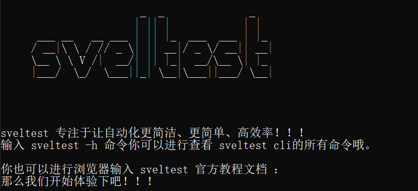
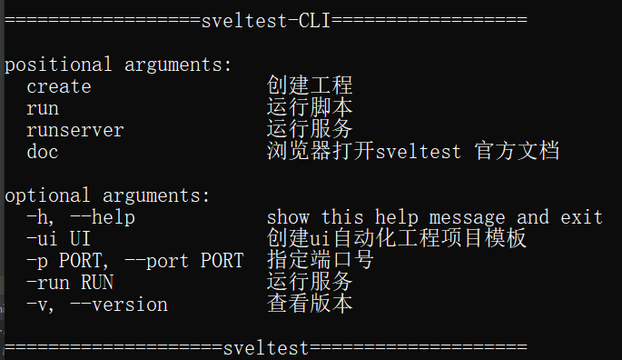

---

layout: doc
title: 入门
---


# 快速入门


## 安装 <Badge text="推荐" />

```bash
pip install sveltest
```


## 卸载<Badge text="推荐" />

```bash
pip uninstall sveltest
```


## 更新

```bash
pip install -U sveltest
```


## 验证sveltest
在windows系统上打开DOS命令窗口,输入`slt`,则可以看到下面内容，证明你已经安装成功了





## 查看帮助

你还可以进行查看slt cli帮助

```powershell
slt -h
```



关于slt cli 的使用点击这里可以进行查看 [slt工具的使用]()

