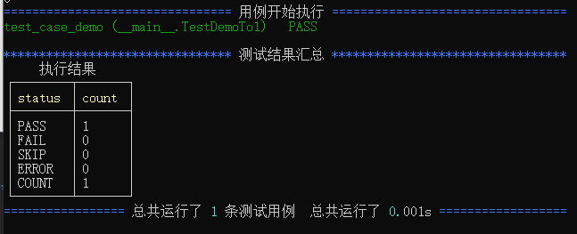

一个简单测试的demo：

```python
from sveltest import TestCase,main


class TestDemoTo1(TestCase):
    """简单的测试demo"""

    def setUp(self):
        pass

    def tearDown(self):
        pass


    def test_case_demo(self):

        self.assertEqual("sveltest","sweet")


if __name__ == '__main__':
    main(verbosity=1)
```

执行后的结果

```python

================================ 用例开始执行 =================================
test_case_demo (__main__.TestDemoTo1)   PASS
******************************** 测试结果汇总 *********************************
     执行结果     
┌────────┬───────┐
│ status │ count │
├────────┼───────┤
│ PASS   │ 1     │
│ FAIL   │ 0     │
│ SKIP   │ 0     │
│ ERROR  │ 0     │
│ COUNT  │ 1     │
└────────┴───────┘
================= 总共运行了 1 条测试用例  总共运行了 0.000s ==================
```

终端的结果:



参数化实例：

```python


from sveltest import TestCase,main
from sveltest.core.components.parameterized import char,parameterized


@parameterized()
class TestDemoTo1(TestCase):
    """简单的测试demo"""

    def setUp(self):
        pass

    def tearDown(self):
        pass

    @char("sweet","testcase")
    def test_case_demo(self,a):
        self.assertEqual("sweet",a,msg=666)


if __name__ == '__main__':
    main(verbosity=1)
    
```

内置参数化、提供多种可能性选择如：随机数据、自定义参数、数据库读取、文件数据读取等

```
================================ 用例开始执行 =================================
test_case_demo_1 (__main__.TestDemoTo1)   PASS
test_case_demo_2 (__main__.TestDemoTo1)   FAIL
-------------------------------- 铺抓到的异常 ---------------------------------
>>> test_case_demo_2 (__main__.TestDemoTo1)
Traceback (most recent call last):
  File "D:\python39\lib\site-packages\sweet\core\components\parameterized.py", 
line 446, in wrapper
    return func(self,*args, **kwargs)
  File "F:\app\test_case_666.py", line 90, in test_case_demo
    self.assertEqual("sweet",a,msg=666)
AssertionError: 'sweet' != 'testcase'
- sweet
+ testcase
 : 666

******************************** 测试结果汇总 *********************************
     执行结果     
┌────────┬───────┐
│ status │ count │
├────────┼───────┤
│ PASS   │ 1     │
│ FAIL   │ 1     │
│ SKIP   │ 0     │
│ ERROR  │ 0     │
│ COUNT  │ 2     │
└────────┴───────┘
================= 总共运行了 2 条测试用例  总共运行了 0.001s ==================

```

