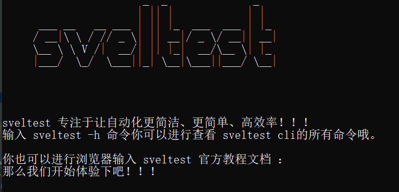
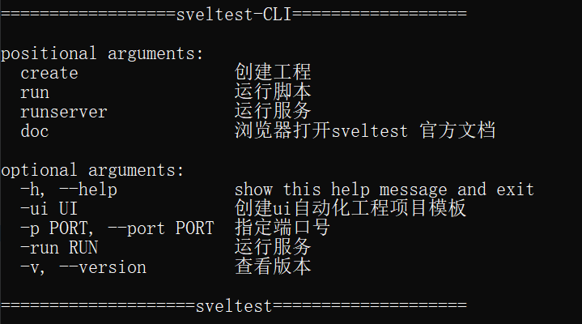
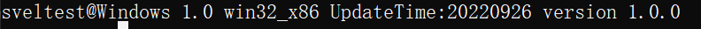

`sveltest cli` 是 `sveltest `框架中的一个命令行工具、可用于创建自动化测试工程相关工程目录(`sveltest `脚手架)、生成自动化测试脚本、启动内置API服务及`sveltest` 相关服务等。



## 命令行工具帮助

```python
slt  -h
```



## 查看工具版本

```python
slt -v
```




## 创建UI自动化测试工程

```python
slt create -ui [项目名称]
```


## 创建API自动化测试工程

> 暂未开放，后续将更新

```python
slt create -api [项目名称]
```


## 关键字生成脚本

```python
slt script -T python -file keyword_template.xlsx  -path d:/
```


## 生成关键字模板

```python
slt script -template 0
```

template参数	0为默认在保存到当前目录下、指定目录则保存到指定的目录下


## 启动API服务

```python
slt runserver
```
