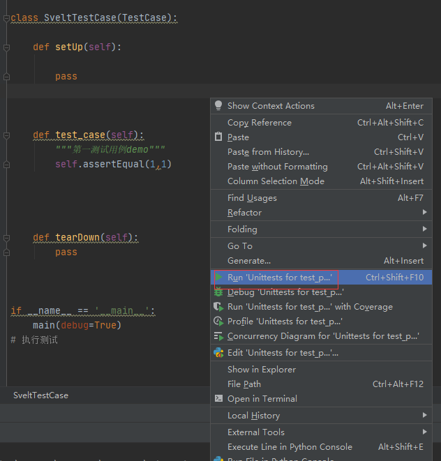
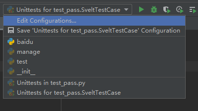
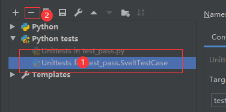
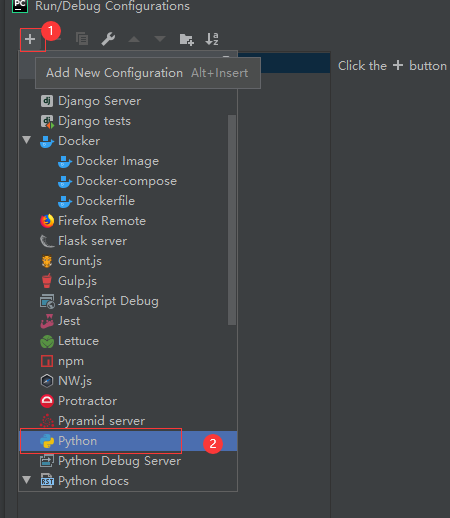
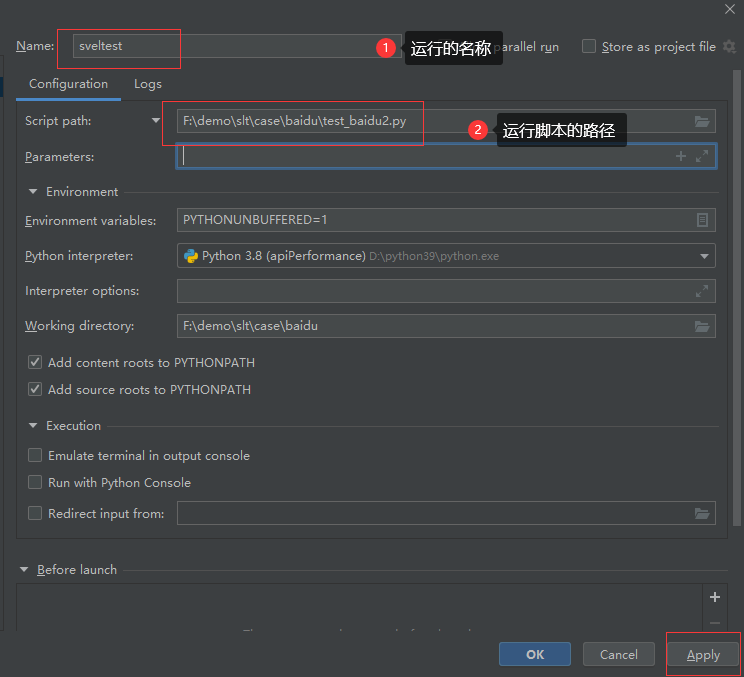
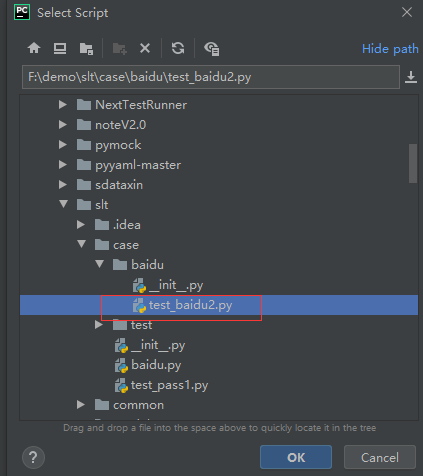
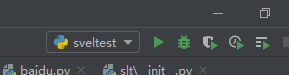
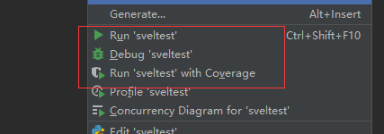

如果你是pycharm，执行运行脚本是出现这样的情况，那么你需要进行做一些配置。

::: details 细节说明

由于`pycharm`如果使用unittest，或者有集成至unittest相关的框架或者类定义时pycharm会自动检查到unittest，那么就会采用pycharm内置的unittest执行器去执行，而pycharm内置的执行是用的python内置的unittest框架去执行相关测试用例的因此如果你想执行带有sveltest的特性效果(sveltest自己实现的相关方法而unittest中没有)则无法体现出来，因此我们需要将其做一些调整，目前仅使用pycharm的同学需要关注这一点。

:::

```
.
----------------------------------------------------------------------
Ran 1 test in 0.000s

OK

```


在pycharm中你编写代码后右键,会出现`Run Unittest for ....`,点击运行后则是使用的原生unittest执行方法去执行的我们比不想这样做。




## 修改运行机制

简单的作法是不使用unittest执行器，直接用运行python脚本即可


首先点击pycharm右上角的 Edit Configurations



然后将unittest tests全部删除掉



新增运行配置



配置运行相关环境




脚本路径需要指定到需要执行的脚本绝对路径




配置完成后点击 Apply 然后再点ok即可完成配置,配置完成后执行环境会变成我们自己配置的了




然后右键会显示我们自己配置的执行环境了




## 测试执行

执行完成后的效果，该效果只有在当前模式下才能出现，因为当前单用例脚本执行只有存在于开发环境，因此在这种情况下sveltest处于[DEBUG]()模式


```
================================ 用例开始执行 =================================
test_case (__main__.SveltTestCase)   PASS
******************************** 测试结果汇总 *********************************
     执行结果     
┌────────┬───────┐
│ status │ count │
├────────┼───────┤
│ PASS   │ 1     │
│ FAIL   │ 0     │
│ SKIP   │ 0     │
│ ERROR  │ 0     │
│ COUNT  │ 1     │
└────────┴───────┘
================= 总共运行了 1 条测试用例  总共运行了 0.000s ==================

```

