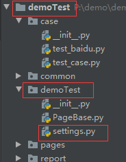

## settings配置文件

::: tip 小知识
sveltest 中的settings配置文件及全局配置加载到引用整个原理，是采用了Python中一个最为优秀的应用开发框架Django settings原理类似
:::


### 那什么是`settings`配置文件呢?

- settings配置文件是`sveltest`自带的一个项目配置文件.该文件下放的是关系`sveltest`项目的一些配置信息

#### 注意事项:

- 该文件下的所有变量名都应该大写,如果你用的是小写的变量,那么不好意思,sveltest 是不会识别的.


### 默认的相关配置项

在sveltest中你创建的工程目录下有一个与你创建的项目名称一样的目录，该目录下就有一个名为settings .py为文件，这个文件就是整个测试框架的配置文件，目前里面有一些简单的默认配置：



```python

BASE_DIR = os.path.dirname(os.path.dirname(os.path.abspath(__file__)))

DEBUG = True

ALLOWED_HOSTS = []

# 日志路徑
LOG_FILE_PATH = {
    'context_processors':{
        'default':os.path.join(BASE_DIR,'report/logs')
    }

}

EXTENDERS_APP_LISTS = [
    'HTMLTestRunner_Chart.HTMLTestRunner'
]

LOGGING_STATUS = False

# Database
# v0.1
DATABASE = {
    "default": {
        "BACKEND": "",
        "LOCATION": "redis://127.0.0.1:6379/9",
        #"OPTIONS": {
        #    "CLIENT_CLASS": "client.DefaultClient",
        #}
    }
}

# 测试用例集路径
CASE_SUITE_PATH = os.path.join(BASE_DIR,"case").replace("\\","/")

# 测试报告
TEST_REPORT = {
    'START_ZIP':True,
    'ZIP':os.path.join(BASE_DIR,'report/zip').replace("\\","/"),
    'HTML':os.path.join(BASE_DIR,'report/html').replace("\\","/"),
    'IMG':os.path.join(BASE_DIR,'report/img').replace("\\","/"),
}

```


### 参数说明：

**BASE_DIR**：动态获取当前项目的根目录

**DEBUG**：是否使用全局的DEBUG模式，默认是开启的。与main()中设置的是相同概念，在生产环境执行测试下需要将DEBUG为False。

**ALLOWED_HOSTS**：ip白名单，目前暂时用不到，无需理会。

**LOG_FILE_PATH**：你的测试执行输出的详细日志存放路径

**EXTENDERS_APP_LISTS**：sveltest组件注册表

**LOGGING_STATUS**：日志状态

**DATABASE**：数据库配置

**CASE_SUITE_PATH**：测试用例集存在的位置，在这里可以指定你需要执行的测试用例目录。

**TEST_REPORT**：测试报告相关配置


## 内置的其他配置

::: tip 提示
sveltest 还有更多的配置，这些配置可能对你很有用[点击这里](/unit/settings)进行查看更多的配置吧！！！
:::