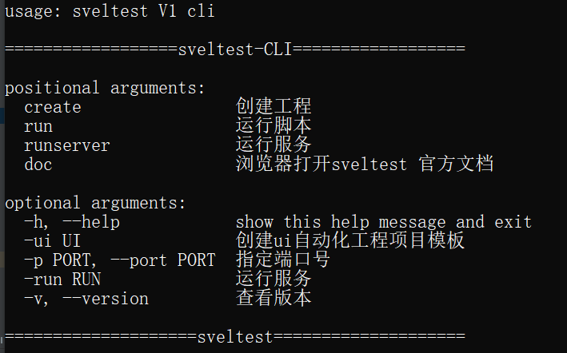
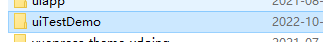

sveltest Cli 工具是sveltest中最为核心的命令行工具、大部分功能都在这个命令行工具中实现的、我们创建的自动化测试工程项目也不例外：


你需要下载好了sveltest框架并且可以正常使用Python。


## 创建一个UI自动化测试框架项目工程

默认创建的是WebUI自动化测试框架结构、遵循的是POM设计模型结构。

你需要进行在指定目录下使用cmd、或者你是linux系统安装好了sveltest即可进行使用sveltest命令进行创建工程这里是window系统示例：


```shell
slt -h #查看帮助
```




## 创建UI自动化测试工程

命令行中输入以下命令，回车后不会有任何结果输出，在指定的目录下查看是否创建成功

```
slt create -ui demoTest
```



进入`uiTestDemo`工程中，整体的工程结构如下：

```
│  manage.py
│
├─case
│  │  test_baidu.py
├─common
├─demoTest
│  │  PageBase.py
│  │  settings.py
├─pages
│  │  BaiduElement.py
├─report
│  ├─html
│  ├─logs

```


## 工程结构

### case 

> 目录为测试用例集存放的地方

因此你需要创建的测试用例应该在该目录下编写测试脚本，如果不在该目录下编写测试脚本那么你无法正常运行测试用例，
具体的sveltest执行用例原理可以点击[这里查看](/unit/advance#测试用例运行原理)


### common
> 存放公共方法

### demoTest
> 项目工程主目录，包含框架配置文件及pagebase对象模型

### pages
> PM模型页面对象存放目录

### report
> 测试结果输出

### manage .py
> 用于管理任务的框架命令行实用程序
